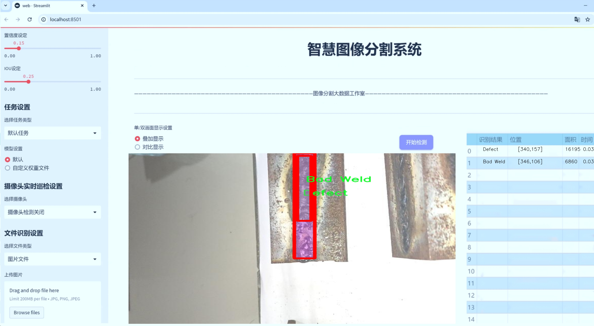
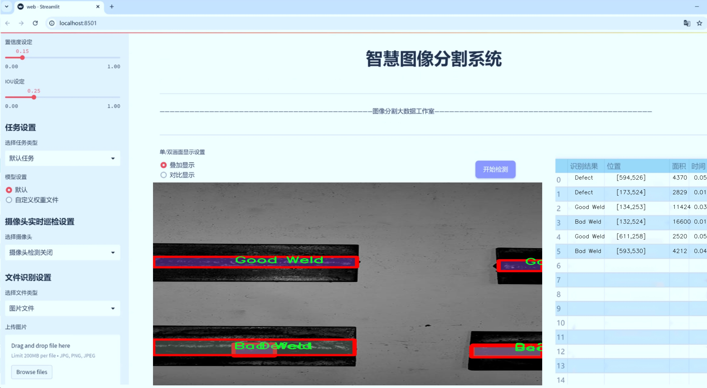
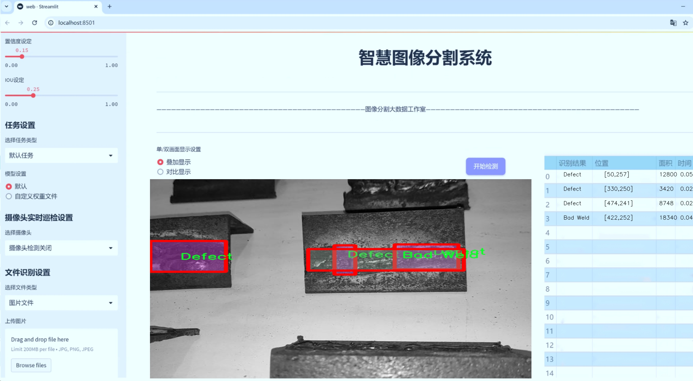
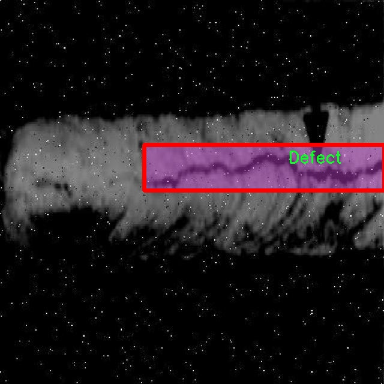
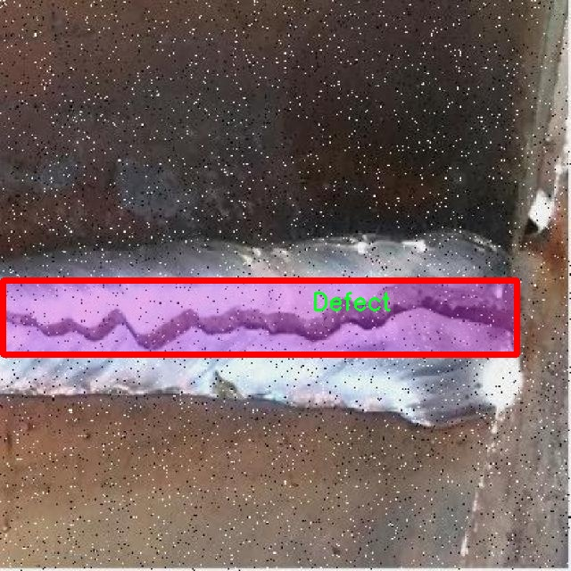
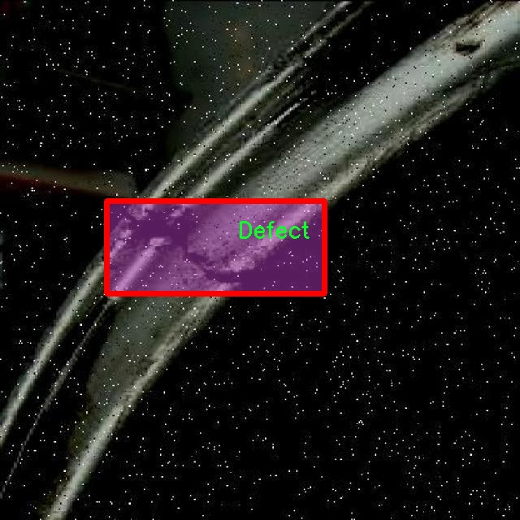
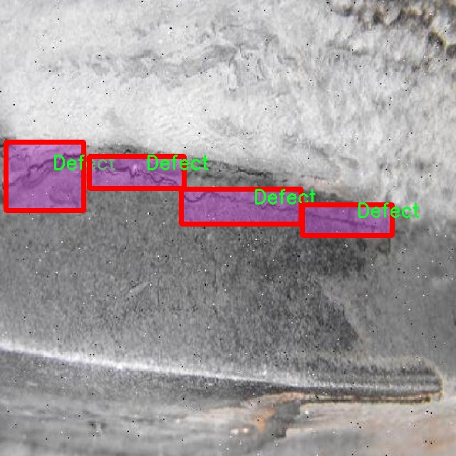
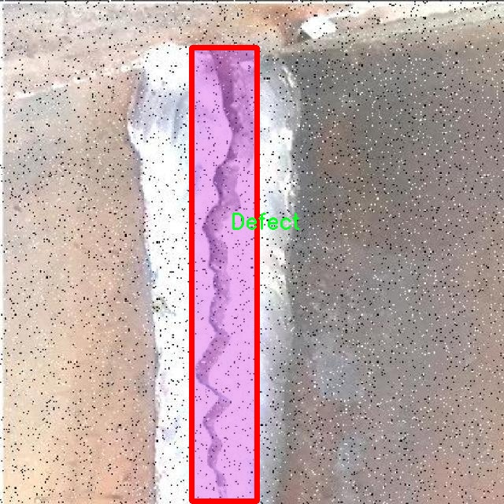

# 焊接缺陷分割系统源码＆数据集分享
 [yolov8-seg-EfficientHead＆yolov8-seg-C2f-Parc等50+全套改进创新点发刊_一键训练教程_Web前端展示]

### 1.研究背景与意义

项目参考[ILSVRC ImageNet Large Scale Visual Recognition Challenge](https://gitee.com/YOLOv8_YOLOv11_Segmentation_Studio/projects)

项目来源[AAAI Global Al lnnovation Contest](https://kdocs.cn/l/cszuIiCKVNis)

研究背景与意义

焊接作为一种广泛应用于制造业的连接技术，其质量直接影响到产品的安全性和可靠性。随着工业自动化和智能制造的不断发展，焊接缺陷的检测与分类已成为确保产品质量的重要环节。传统的焊接缺陷检测方法多依赖人工检查或简单的图像处理技术，这些方法不仅效率低下，而且容易受到人为因素的影响，导致漏检或误检。因此，基于深度学习的自动化检测技术逐渐成为研究的热点，尤其是实例分割技术在焊接缺陷检测中的应用，展现出了良好的前景。

YOLO（You Only Look Once）系列模型因其高效的实时检测能力而受到广泛关注。YOLOv8作为该系列的最新版本，进一步提升了检测精度和速度，尤其在复杂背景下的目标检测表现出色。然而，尽管YOLOv8在目标检测领域取得了显著的成果，但在焊接缺陷的实例分割任务中仍存在一些挑战。焊接缺陷的种类繁多，包括“Bad Weld”、“Defect”和“Good Weld”等，每种缺陷的特征和表现形式各异，这对模型的训练和推理提出了更高的要求。因此，改进YOLOv8以适应焊接缺陷的实例分割任务，不仅具有重要的理论意义，也为实际应用提供了可行的解决方案。

本研究旨在基于改进的YOLOv8模型，构建一个高效的焊接缺陷分割系统。我们将使用包含1100幅图像的数据集，涵盖三类焊接缺陷，分别为“Bad Weld”、“Defect”和“Good Weld”。该数据集的多样性和丰富性为模型的训练提供了良好的基础。通过对YOLOv8模型的改进，我们期望在实例分割的精度和效率上实现突破，从而提升焊接缺陷检测的自动化水平。

在工业4.0背景下，智能化的焊接缺陷检测系统不仅可以提高生产效率，降低人工成本，还能有效减少因焊接缺陷导致的安全隐患。因此，研究基于改进YOLOv8的焊接缺陷分割系统具有重要的实际应用价值。通过实现高精度的焊接缺陷检测，我们能够为制造业提供更为可靠的质量保障，推动智能制造的发展。

此外，本研究还将为深度学习在工业视觉检测领域的应用提供新的思路和方法。通过对YOLOv8模型的改进和优化，我们将探索深度学习技术在特定领域中的适应性和可扩展性，进而为其他领域的实例分割任务提供借鉴和参考。这不仅有助于推动焊接技术的进步，也为相关研究提供了新的视角和方向。

综上所述，基于改进YOLOv8的焊接缺陷分割系统的研究，不仅具有重要的理论意义和实际应用价值，也为推动智能制造和工业自动化的发展贡献了新的力量。

### 2.图片演示







##### 注意：由于此博客编辑较早，上面“2.图片演示”和“3.视频演示”展示的系统图片或者视频可能为老版本，新版本在老版本的基础上升级如下：（实际效果以升级的新版本为准）

  （1）适配了YOLOV8的“目标检测”模型和“实例分割”模型，通过加载相应的权重（.pt）文件即可自适应加载模型。

  （2）支持“图片识别”、“视频识别”、“摄像头实时识别”三种识别模式。

  （3）支持“图片识别”、“视频识别”、“摄像头实时识别”三种识别结果保存导出，解决手动导出（容易卡顿出现爆内存）存在的问题，识别完自动保存结果并导出到tempDir中。

  （4）支持Web前端系统中的标题、背景图等自定义修改，后面提供修改教程。

  另外本项目提供训练的数据集和训练教程,暂不提供权重文件（best.pt）,需要您按照教程进行训练后实现图片演示和Web前端界面演示的效果。

### 3.视频演示

[3.1 视频演示](https://www.bilibili.com/video/BV1uZDcYDEcq/)

### 4.数据集信息展示

##### 4.1 本项目数据集详细数据（类别数＆类别名）

nc: 3
names: ['Bad Weld', 'Defect', 'Good Weld']


##### 4.2 本项目数据集信息介绍

数据集信息展示

在本研究中，我们使用了名为“test2”的数据集，以训练和改进YOLOv8-seg焊接缺陷分割系统。该数据集专门设计用于焊接质量检测，涵盖了焊接过程中的不同缺陷类型。通过对焊接图像的深度学习分析，我们希望能够提高缺陷检测的准确性和效率，从而在工业应用中实现更高的焊接质量标准。

“test2”数据集包含三种主要类别，分别是“Bad Weld”（不良焊接）、“Defect”（缺陷）和“Good Weld”（良好焊接）。这三类标签的设置不仅反映了焊接质量的不同状态，也为模型的训练提供了清晰的目标。具体而言，“Bad Weld”类别代表了那些由于焊接工艺不当而导致的明显缺陷，如气孔、裂纹或未熔合等问题；“Defect”类别则涵盖了那些不易察觉但仍可能影响焊接质量的微小缺陷，例如表面不平整或焊缝宽度不均；而“Good Weld”类别则标识了符合标准的焊接样本，作为模型学习的正面示例。

数据集的构建过程严格遵循焊接质量检测的实际需求，确保每个类别的样本数量和多样性，以便于模型在训练过程中能够学习到丰富的特征信息。我们通过收集和标注大量的焊接图像，确保每个类别的样本在不同的焊接条件、材料类型和工艺参数下都有所涵盖。这种多样性不仅增强了模型的泛化能力，也提高了其在实际应用中的可靠性。

在数据集的标注过程中，我们采用了高精度的图像标注工具，对每个焊接图像进行细致的分类和分割。这一过程确保了数据集的高质量，进而为YOLOv8-seg模型的训练提供了坚实的基础。通过使用这种分割技术，我们能够在图像中精确地标识出焊接缺陷的位置和类型，使得模型在进行缺陷检测时能够更为准确地定位和识别。

此外，为了进一步提升模型的性能，我们还进行了数据增强处理。这包括图像旋转、缩放、翻转以及亮度和对比度的调整等操作，以增加数据集的多样性，帮助模型更好地适应不同的焊接场景和条件。这种增强策略不仅丰富了训练数据，还有效地减少了模型对特定样本的过拟合风险。

综上所述，“test2”数据集的构建和使用为改进YOLOv8-seg焊接缺陷分割系统提供了重要支持。通过对焊接缺陷的精确分类和高质量标注，我们希望能够训练出一个更加智能和高效的检测系统，从而在焊接质量控制领域发挥积极作用。随着技术的不断进步，我们期待这一系统能够在实际应用中实现更高的检测准确率，推动焊接行业的质量提升和智能化发展。











### 5.全套项目环境部署视频教程（零基础手把手教学）

[5.1 环境部署教程链接（零基础手把手教学）](https://www.bilibili.com/video/BV1jG4Ve4E9t/?vd_source=bc9aec86d164b67a7004b996143742dc)


[5.2 安装Python虚拟环境创建和依赖库安装视频教程链接（零基础手把手教学）](https://www.bilibili.com/video/BV1nA4VeYEze/?vd_source=bc9aec86d164b67a7004b996143742dc)

### 6.手把手YOLOV8-seg训练视频教程（零基础小白有手就能学会）

[6.1 手把手YOLOV8-seg训练视频教程（零基础小白有手就能学会）](https://www.bilibili.com/video/BV1cA4VeYETe/?vd_source=bc9aec86d164b67a7004b996143742dc)


按照上面的训练视频教程链接加载项目提供的数据集，运行train.py即可开始训练



     Epoch   gpu_mem       box       obj       cls    labels  img_size
     1/200     0G   0.01576   0.01955  0.007536        22      1280: 100%|██████████| 849/849 [14:42<00:00,  1.04s/it]
               Class     Images     Labels          P          R     mAP@.5 mAP@.5:.95: 100%|██████████| 213/213 [01:14<00:00,  2.87it/s]
                 all       3395      17314      0.994      0.957      0.0957      0.0843

     Epoch   gpu_mem       box       obj       cls    labels  img_size
     2/200     0G   0.01578   0.01923  0.007006        22      1280: 100%|██████████| 849/849 [14:44<00:00,  1.04s/it]
               Class     Images     Labels          P          R     mAP@.5 mAP@.5:.95: 100%|██████████| 213/213 [01:12<00:00,  2.95it/s]
                 all       3395      17314      0.996      0.956      0.0957      0.0845

     Epoch   gpu_mem       box       obj       cls    labels  img_size
     3/200     0G   0.01561    0.0191  0.006895        27      1280: 100%|██████████| 849/849 [10:56<00:00,  1.29it/s]
               Class     Images     Labels          P          R     mAP@.5 mAP@.5:.95: 100%|███████   | 187/213 [00:52<00:00,  4.04it/s]
                 all       3395      17314      0.996      0.957      0.0957      0.0845


### 7.50+种全套YOLOV8-seg创新点代码加载调参视频教程（一键加载写好的改进模型的配置文件）

[7.1 50+种全套YOLOV8-seg创新点代码加载调参视频教程（一键加载写好的改进模型的配置文件）](https://www.bilibili.com/video/BV1Hw4VePEXv/?vd_source=bc9aec86d164b67a7004b996143742dc)

### 8.YOLOV8-seg图像分割算法原理

原始YOLOv8-seg算法原理

YOLOv8-seg算法是YOLO系列目标检测算法的最新版本，结合了目标检测与语义分割的特性，旨在实现高效且准确的图像分析。该算法在YOLOv5和YOLOv7的基础上进行了多项创新，尤其是在网络结构、特征提取和损失函数的设计上，显著提升了模型的性能和应用范围。

首先，YOLOv8-seg的网络结构依然采用了经典的输入层、主干网络、特征融合层和解耦头设计。主干网络部分，YOLOv8-seg使用了CSPDarknet的思想，并将YOLOv5中的C3模块替换为C2f模块。C2f模块的设计灵感来源于YOLOv7的ELAN结构，具有更好的特征提取能力和梯度流动性。C2f模块通过引入多个分支和shortcut连接，有效缓解了深层网络中的梯度消失问题，同时增强了浅层特征的重用。这种设计使得YOLOv8-seg在进行目标检测时，能够同时提取细节信息和高层语义信息，从而提升了对复杂场景的理解能力。

在特征融合层，YOLOv8-seg采用了PAN-FPN结构，以实现多尺度特征的深度融合。该结构通过自下而上的方式将高层特征与中层和浅层特征进行融合，确保不同尺度的信息能够充分结合。YOLOv8-seg在这一阶段的设计中，去除了YOLOv5中的某些冗余卷积操作，简化了特征融合的过程，使得特征图的生成更加高效。这种高效的特征融合策略不仅提高了目标检测的精度，还增强了模型对不同尺度目标的适应能力。

YOLOv8-seg的解耦头部分则是其另一大创新点。与传统的Anchor-based方法不同，YOLOv8-seg采用了Anchor-Free的设计理念，直接从特征图中进行目标的分类和边框回归。这种设计使得模型在处理小目标时表现更加优越，因为它能够更灵活地适应目标的形状和大小。此外，YOLOv8-seg的解耦头部分引入了Distribution Focal Loss和CIoU Loss作为损失函数，这一组合不仅解决了样本不平衡的问题，还提高了模型对困难样本的学习能力。

在数据预处理方面，YOLOv8-seg继承了YOLOv5的增强策略，包括马赛克增强、混合增强、空间扰动和颜色扰动等。这些数据增强手段有效地扩展了训练数据集的多样性，使得模型在面对不同场景和光照条件时，能够保持较高的鲁棒性。

值得注意的是，YOLOv8-seg在样本匹配策略上也进行了创新。它采用了Task-Aligned的Assigner匹配方式，取代了传统的静态匹配。这一变化使得模型在训练过程中能够更加灵活地适应不同的任务需求，进一步提升了检测的准确性和效率。

总的来说，YOLOv8-seg算法通过对网络结构的优化、特征融合的增强以及损失函数的创新，成功地将目标检测与语义分割结合在一起。其在处理复杂场景、提高检测精度和鲁棒性方面的表现，标志着YOLO系列算法的又一次飞跃。未来，YOLOv8-seg有望在自动驾驶、智能监控和医疗影像等领域发挥更大的作用，推动计算机视觉技术的进一步发展。


### 9.系统功能展示（检测对象为举例，实际内容以本项目数据集为准）

图9.1.系统支持检测结果表格显示

  图9.2.系统支持置信度和IOU阈值手动调节

  图9.3.系统支持自定义加载权重文件best.pt(需要你通过步骤5中训练获得)

  图9.4.系统支持摄像头实时识别

  图9.5.系统支持图片识别

  图9.6.系统支持视频识别

  图9.7.系统支持识别结果文件自动保存

  图9.8.系统支持Excel导出检测结果数据


### 10.50+种全套YOLOV8-seg创新点原理讲解（非科班也可以轻松写刊发刊，V11版本正在科研待更新）

#### 10.1 由于篇幅限制，每个创新点的具体原理讲解就不一一展开，具体见下列网址中的创新点对应子项目的技术原理博客网址【Blog】：


[10.1 50+种全套YOLOV8-seg创新点原理讲解链接](https://gitee.com/qunmasj/good)

#### 10.2 部分改进模块原理讲解(完整的改进原理见上图和技术博客链接)【如果此小节的图加载失败可以通过CSDN或者Github搜索该博客的标题访问原始博客，原始博客图片显示正常】
### YOLOv8简介

YOLOv8 是 Ultralytics 公司继 YOLOv5 算法之后开发的下一代算法模型，目前支持图像分类、物体检测和实例分割任务。YOLOv8 是一个 SOTA 模型，它建立在之前YOLO 系列模型的成功基础上，并引入了新的功能和改进，以进一步提升性能和灵活性。具体创新包括：一个新的骨干网络、一个新的 Ancher-Free 检测头和一个新的损失函数，可以在从 CPU 到 GPU 的各种硬件平台上运行。注意到ultralytics 并没有直接将开源库命名为 YOLOv8，而是直接使用 Ultralytics这个单词，原因是Ultralytics这个库的定位是算法框架，而非特指某一个特定算法，其希望这个库不仅仅能够用于 YOLO 系列模型，同时也能支持其他的视觉任务如图像分类、实例分割等。下图画图YOLOv8目标检测算法同其他YOLO系列算法（YOLOv5、6、7）的实验对比图，左边是模型参数量对比，右边是速度对比。


下面两个表分别是YOLOv8和YOLOv5（v7.0版本）官方在 COCO Val 2017 数据集上测试结果，从中看出 YOLOv8 相比 YOLOv5 精度提升大，但是 N/S/M 模型相应的参数量、FLOPS等提高了不少。


#### YOLOv8概述
提供了一个全新的SOTA模型，和YOLOv5一样，基于缩放系数也提供了 N/S/M/L/X 尺度的不同大小模型，用于满足不同场景需求，同时支持图像分类、目标检测、实例分割和姿态检测任务
在骨干网络和Neck部分将YOLOv5的C3结构换成了梯度流更丰富的 C2f 结构，并对不同尺度模型调整了不同的通道数，大幅提升了模型性能；需要注意的是C2f 模块中存在Split等操作对特定硬件部署没有之前那么友好


Head部分换成了目前主流的解耦头结构，将分类和检测头分离，同时也从 Anchor-Based换成了Anchor-Free Loss
计算方面采用了 TaskAlignedAssigner 正样本分配策略，并引入了 Distribution Focal Loss
下图画出YOLOv8目标检测算法的整体结构图


#### YOLOv8模型
YOLOv8目标检测算法的模型配置文件如下：


从配置文件可以看出，YOLOv8与YOLOv5模型最明显的差异是使用C2F模块替换了原来的C3模块，两个模块的结构图下图所示。


另外Head 部分变化最大，从原先的耦合头变成了解耦头，并且从 YOLOv5 的 Anchor-Based 变成了 Anchor-Free。其结构对比图如下所示：

### RepViT简介

近年来，与轻量级卷积神经网络(cnn)相比，轻量级视觉变压器(ViTs)在资源受限的移动设备上表现出了更高的性能和更低的延迟。这种改进通常归功于多头自注意模块，它使模型能够学习全局表示。然而，轻量级vit和轻量级cnn之间的架构差异还没有得到充分的研究。在这项研究中，我们重新审视了轻量级cnn的高效设计，并强调了它们在移动设备上的潜力。通过集成轻量级vit的高效架构选择，我们逐步增强了标准轻量级CNN的移动友好性，特别是MobileNetV3。这就产生了一个新的纯轻量级cnn家族，即RepViT。大量的实验表明，RepViT优于现有的轻型vit，并在各种视觉任务中表现出良好的延迟。在ImageNet上，RepViT在iPhone 12上以近1ms的延迟实现了超过80%的top-1精度，据我们所知，这是轻量级模型的第一次。

#### RepViT简介
轻量级模型研究一直是计算机视觉任务中的一个焦点，其目标是在降低计算成本的同时达到优秀的性能。轻量级模型与资源受限的移动设备尤其相关，使得视觉模型的边缘部署成为可能。在过去十年中，研究人员主要关注轻量级卷积神经网络（CNNs）的设计，提出了许多高效的设计原则，包括可分离卷积 、逆瓶颈结构 、通道打乱 和结构重参数化等，产生了 MobileNets ，ShuffleNets和 RepVGG 等代表性模型。

另一方面，视觉 Transformers（ViTs）成为学习视觉表征的另一种高效方案。与 CNNs 相比，ViTs 在各种计算机视觉任务中表现出了更优越的性能。然而，ViT 模型一般尺寸很大，延迟很高，不适合资源受限的移动设备。因此，研究人员开始探索 ViT 的轻量级设计。许多高效的ViTs设计原则被提出，大大提高了移动设备上 ViTs 的计算效率，产生了EfficientFormers ，MobileViTs等代表性模型。这些轻量级 ViTs 在移动设备上展现出了相比 CNNs 的更强的性能和更低的延迟。

轻量级 ViTs 优于轻量级 CNNs 的原因通常归结于多头注意力模块，该模块使模型能够学习全局表征。然而，轻量级 ViTs 和轻量级 CNNs 在块结构、宏观和微观架构设计方面存在值得注意的差异，但这些差异尚未得到充分研究。这自然引出了一个问题：轻量级 ViTs 的架构选择能否提高轻量级 CNN 的性能？在这项工作中，我们结合轻量级 ViTs 的架构选择，重新审视了轻量级 CNNs 的设计。我们的旨在缩小轻量级 CNNs 与轻量级 ViTs 之间的差距，并强调前者与后者相比在移动设备上的应用潜力。


在 ConvNeXt 中，参考该博客提出的基于 ResNet50 架构的基础上通过严谨的理论和实验分析，最终设计出一个非常优异的足以媲美 Swin-Transformer 的纯卷积神经网络架构。同样地，RepViT也是主要通过将轻量级 ViTs 的架构设计逐步整合到标准轻量级 CNN，即MobileNetV3-L，来对其进行针对性地改造（魔改）。在这个过程中，作者们考虑了不同粒度级别的设计元素，并通过一系列步骤达到优化的目标。


详细优化步骤如下：

#### 训练配方的对齐
论文中引入了一种衡量移动设备上延迟的指标，并将训练策略与现有的轻量级 ViTs 对齐。这一步骤主要是为了确保模型训练的一致性，其涉及两个概念，即延迟度量和训练策略的调整。

#### 延迟度量指标
为了更准确地衡量模型在真实移动设备上的性能，作者选择了直接测量模型在设备上的实际延迟，以此作为基准度量。这个度量方法不同于之前的研究，它们主要通过FLOPs或模型大小等指标优化模型的推理速度，这些指标并不总能很好地反映在移动应用中的实际延迟。

#### 训练策略的对齐
这里，将 MobileNetV3-L 的训练策略调整以与其他轻量级 ViTs 模型对齐。这包括使用 AdamW 优化器-ViTs 模型必备的优化器，进行 5 个 epoch 的预热训练，以及使用余弦退火学习率调度进行 300 个 epoch 的训练。尽管这种调整导致了模型准确率的略微下降，但可以保证公平性。

#### 块设计的优化
基于一致的训练设置，作者们探索了最优的块设计。块设计是 CNN 架构中的一个重要组成部分，优化块设计有助于提高网络的性能。

#### 分离 Token 混合器和通道混合器
这块主要是对 MobileNetV3-L 的块结构进行了改进，分离了令牌混合器和通道混合器。原来的 MobileNetV3 块结构包含一个 1x1 扩张卷积，然后是一个深度卷积和一个 1x1 的投影层，然后通过残差连接连接输入和输出。在此基础上，RepViT 将深度卷积提前，使得通道混合器和令牌混合器能够被分开。为了提高性能，还引入了结构重参数化来在训练时为深度滤波器引入多分支拓扑。最终，作者们成功地在 MobileNetV3 块中分离了令牌混合器和通道混合器，并将这种块命名为 RepViT 块。

#### 降低扩张比例并增加宽度
在通道混合器中，原本的扩张比例是 4，这意味着 MLP 块的隐藏维度是输入维度的四倍，消耗了大量的计算资源，对推理时间有很大的影响。为了缓解这个问题，我们可以将扩张比例降低到 2，从而减少了参数冗余和延迟，使得 MobileNetV3-L 的延迟降低到 0.65ms。随后，通过增加网络的宽度，即增加各阶段的通道数量，Top-1 准确率提高到 73.5%，而延迟只增加到 0.89ms！

#### 宏观架构元素的优化
在这一步，本文进一步优化了MobileNetV3-L在移动设备上的性能，主要是从宏观架构元素出发，包括 stem，降采样层，分类器以及整体阶段比例。通过优化这些宏观架构元素，模型的性能可以得到显著提高。

#### 浅层网络使用卷积提取器
ViTs 通常使用一个将输入图像分割成非重叠补丁的 “patchify” 操作作为 stem。然而，这种方法在训练优化性和对训练配方的敏感性上存在问题。因此，作者们采用了早期卷积来代替，这种方法已经被许多轻量级 ViTs 所采纳。对比之下，MobileNetV3-L 使用了一个更复杂的 stem 进行 4x 下采样。这样一来，虽然滤波器的初始数量增加到24，但总的延迟降低到0.86ms，同时 top-1 准确率提高到 73.9%。

#### 更深的下采样层
在 ViTs 中，空间下采样通常通过一个单独的补丁合并层来实现。因此这里我们可以采用一个单独和更深的下采样层，以增加网络深度并减少由于分辨率降低带来的信息损失。具体地，作者们首先使用一个 1x1 卷积来调整通道维度，然后将两个 1x1 卷积的输入和输出通过残差连接，形成一个前馈网络。此外，他们还在前面增加了一个 RepViT 块以进一步加深下采样层，这一步提高了 top-1 准确率到 75.4%，同时延迟为 0.96ms。

#### 更简单的分类器
在轻量级 ViTs 中，分类器通常由一个全局平均池化层后跟一个线性层组成。相比之下，MobileNetV3-L 使用了一个更复杂的分类器。因为现在最后的阶段有更多的通道，所以作者们将它替换为一个简单的分类器，即一个全局平均池化层和一个线性层，这一步将延迟降低到 0.77ms，同时 top-1 准确率为 74.8%。

#### 整体阶段比例
阶段比例代表了不同阶段中块数量的比例，从而表示了计算在各阶段中的分布。论文选择了一个更优的阶段比例 1:1:7:1，然后增加网络深度到 2:2:14:2，从而实现了一个更深的布局。这一步将 top-1 准确率提高到 76.9%，同时延迟为 1.02 ms。

#### 卷积核大小的选择
众所周知，CNNs 的性能和延迟通常受到卷积核大小的影响。例如，为了建模像 MHSA 这样的远距离上下文依赖，ConvNeXt 使用了大卷积核，从而实现了显著的性能提升。然而，大卷积核对于移动设备并不友好，因为它的计算复杂性和内存访问成本。MobileNetV3-L 主要使用 3x3 的卷积，有一部分块中使用 5x5 的卷积。作者们将它们替换为3x3的卷积，这导致延迟降低到 1.00ms，同时保持了76.9%的top-1准确率。

#### SE 层的位置
自注意力模块相对于卷积的一个优点是根据输入调整权重的能力，这被称为数据驱动属性。作为一个通道注意力模块，SE层可以弥补卷积在缺乏数据驱动属性上的限制，从而带来更好的性能。MobileNetV3-L 在某些块中加入了SE层，主要集中在后两个阶段。然而，与分辨率较高的阶段相比，分辨率较低的阶段从SE提供的全局平均池化操作中获得的准确率提升较小。作者们设计了一种策略，在所有阶段以交叉块的方式使用SE层，从而在最小的延迟增量下最大化准确率的提升，这一步将top-1准确率提升到77.4%，同时延迟降低到0.87ms。

注意！【这一点其实百度在很早前就已经做过实验比对得到过这个结论了，SE 层放置在靠近深层的地方效果好】

#### 微观设计的调整
RepViT 通过逐层微观设计来调整轻量级 CNN，这包括选择合适的卷积核大小和优化挤压-激励（Squeeze-and-excitation，简称SE）层的位置。这两种方法都能显著改善模型性能。

#### 网络架构
最终，通过整合上述改进策略，我们便得到了模型RepViT的整体架构，该模型有多个变种，例如RepViT-M1/M2/M3。同样地，不同的变种主要通过每个阶段的通道数和块数来区分。


### 11.项目核心源码讲解（再也不用担心看不懂代码逻辑）

#### 11.1 ultralytics\utils\benchmarks.py

以下是对代码的核心部分进行的分析和详细注释：

```python
import pandas as pd
import time
from pathlib import Path
from ultralytics import YOLO
from ultralytics.utils import select_device, check_requirements, check_yolo
from ultralytics.engine.exporter import export_formats

def benchmark(model=WEIGHTS_DIR / 'yolov8n.pt',
              data=None,
              imgsz=160,
              half=False,
              int8=False,
              device='cpu',
              verbose=False):
    """
    基准测试YOLO模型在不同格式下的速度和准确性。

    参数:
        model (str | Path | optional): 模型文件或目录的路径，默认是 'yolov8n.pt'。
        data (str, optional): 用于评估的数据集，默认为None。
        imgsz (int, optional): 基准测试的图像大小，默认是160。
        half (bool, optional): 如果为True，则使用半精度模型，默认是False。
        int8 (bool, optional): 如果为True，则使用int8精度模型，默认是False。
        device (str, optional): 运行基准测试的设备，可以是'cpu'或'cuda'，默认是'cpu'。
        verbose (bool | float | optional): 如果为True或浮点数，则根据给定的指标断言基准测试通过，默认是False。

    返回:
        df (pandas.DataFrame): 包含每种格式的基准测试结果的DataFrame，包括文件大小、指标和推理时间。
    """
    
    pd.options.display.max_columns = 10  # 设置pandas显示的最大列数
    pd.options.display.width = 120  # 设置pandas显示的宽度
    device = select_device(device, verbose=False)  # 选择设备
    if isinstance(model, (str, Path)):
        model = YOLO(model)  # 加载YOLO模型

    results = []  # 存储结果的列表
    start_time = time.time()  # 记录开始时间

    # 遍历不同的导出格式
    for i, (name, format, suffix, cpu, gpu) in export_formats().iterrows():
        emoji, filename = '❌', None  # 默认导出状态为失败
        try:
            # 检查导出格式的支持条件
            if i == 9:
                assert LINUX, 'Edge TPU export only supported on Linux'
            if i == 10:
                assert MACOS or LINUX, 'TF.js export only supported on macOS and Linux'
            if 'cpu' in device.type:
                assert cpu, 'inference not supported on CPU'
            if 'cuda' in device.type:
                assert gpu, 'inference not supported on GPU'

            # 导出模型
            if format == '-':
                filename = model.ckpt_path or model.cfg  # PyTorch格式
                exported_model = model  # 使用原始模型
            else:
                filename = model.export(imgsz=imgsz, format=format, half=half, int8=int8, device=device, verbose=False)
                exported_model = YOLO(filename, task=model.task)  # 加载导出的模型
                assert suffix in str(filename), 'export failed'  # 检查导出后缀

            emoji = '✅'  # 导出成功

            # 进行推理
            exported_model.predict(ASSETS / 'bus.jpg', imgsz=imgsz, device=device, half=half)

            # 验证模型
            data = data or TASK2DATA[model.task]  # 获取数据集
            key = TASK2METRIC[model.task]  # 获取评估指标
            results_dict = exported_model.val(data=data, batch=1, imgsz=imgsz, plots=False, device=device, half=half, int8=int8, verbose=False)
            metric, speed = results_dict.results_dict[key], results_dict.speed['inference']  # 获取指标和推理速度
            results.append([name, '✅', round(file_size(filename), 1), round(metric, 4), round(speed, 2)])  # 添加结果

        except Exception as e:
            LOGGER.warning(f'ERROR ❌️ Benchmark failure for {name}: {e}')  # 记录错误
            results.append([name, emoji, round(file_size(filename), 1), None, None])  # 添加失败结果

    # 打印结果
    check_yolo(device=device)  # 打印系统信息
    df = pd.DataFrame(results, columns=['Format', 'Status❔', 'Size (MB)', key, 'Inference time (ms/im)'])  # 创建结果DataFrame

    name = Path(model.ckpt_path).name
    s = f'\nBenchmarks complete for {name} on {data} at imgsz={imgsz} ({time.time() - start_time:.2f}s)\n{df}\n'
    LOGGER.info(s)  # 记录基准测试完成信息

    return df  # 返回结果DataFrame
```

### 代码核心部分分析

1. **导入模块**：导入了必要的库和模块，包括`pandas`用于数据处理，`time`用于时间测量，`Path`用于路径操作，以及`YOLO`模型和一些工具函数。

2. **benchmark函数**：该函数用于基准测试YOLO模型的性能，支持多种模型格式的导出和评估。函数参数允许用户自定义模型路径、数据集、图像大小、精度等。

3. **模型导出与推理**：函数通过`export_formats()`获取不同的模型格式，进行模型导出，并在导出后进行推理和验证，记录每种格式的性能指标。

4. **异常处理**：在导出和推理过程中使用`try-except`结构捕获可能的异常，并记录错误信息。

5. **结果记录与返回**：最终将所有结果存储在`DataFrame`中，并返回给调用者，同时记录基准测试的完成信息。

以上是对代码的核心部分及其功能的详细注释和分析。

这个文件是Ultralytics YOLO项目中的一个基准测试模块，主要用于评估YOLO模型在不同格式下的速度和准确性。该模块提供了两种主要功能：基准测试（benchmark）和模型性能分析（ProfileModels）。

首先，`benchmark`函数是这个模块的核心功能之一。它允许用户通过指定模型文件路径、数据集、图像大小、设备类型等参数来对YOLO模型进行基准测试。函数内部首先设置了一些参数，包括模型路径、数据集、图像大小、是否使用半精度或整型8位精度等。接着，它会遍历不同的模型格式，尝试导出模型并进行推理测试。对于每种格式，函数会记录模型的文件大小、评估指标（如mAP）和推理时间，并将结果存储在一个Pandas DataFrame中。最后，函数会输出测试结果，并将其写入日志文件。

接下来，`ProfileModels`类用于分析不同模型在ONNX和TensorRT格式下的性能。这个类允许用户传入多个模型路径，并对每个模型进行性能分析，包括速度和FLOPs（每秒浮点运算次数）。在初始化时，用户可以设置一些参数，例如定时运行的次数、预热运行的次数、最小运行时间、图像大小等。类中包含的方法会收集模型文件，导出ONNX和TensorRT格式的模型，并对其进行基准测试。最终，结果会以表格的形式输出，方便用户进行比较。

文件中还包含了一些辅助函数，例如获取模型文件、执行模型推理、生成表格行等。这些函数帮助简化了主要功能的实现，使得代码结构更加清晰。

总的来说，这个文件为YOLO模型的性能评估提供了一个全面的框架，用户可以方便地测试和比较不同格式模型的速度和准确性。

#### 11.2 ultralytics\engine\trainer.py

以下是代码中最核心的部分，并附上详细的中文注释：

```python
class BaseTrainer:
    """
    BaseTrainer 类用于创建训练器的基类。

    属性:
        args (SimpleNamespace): 训练器的配置。
        model (nn.Module): 模型实例。
        device (torch.device): 训练所用的设备。
        trainset (torch.utils.data.Dataset): 训练数据集。
        testset (torch.utils.data.Dataset): 测试数据集。
        optimizer (torch.optim.Optimizer): 优化器实例。
        scheduler (torch.optim.lr_scheduler._LRScheduler): 学习率调度器。
    """

    def __init__(self, cfg=DEFAULT_CFG, overrides=None):
        """
        初始化 BaseTrainer 类。

        参数:
            cfg (str, optional): 配置文件的路径，默认为 DEFAULT_CFG。
            overrides (dict, optional): 配置覆盖，默认为 None。
        """
        self.args = get_cfg(cfg, overrides)  # 获取配置
        self.device = select_device(self.args.device, self.args.batch)  # 选择设备
        self.model = None  # 初始化模型
        self.trainset, self.testset = None, None  # 初始化训练和测试数据集
        self.optimizer = None  # 初始化优化器
        self.scheduler = None  # 初始化学习率调度器

    def train(self):
        """开始训练过程。"""
        world_size = len(self.args.device.split(',')) if isinstance(self.args.device, str) else 1  # 计算世界大小
        if world_size > 1:  # 如果是多GPU训练
            self._setup_ddp(world_size)  # 设置分布式数据并行
        self._setup_train(world_size)  # 设置训练

        for epoch in range(self.args.epochs):  # 遍历每个epoch
            self.model.train()  # 设置模型为训练模式
            for batch in self.train_loader:  # 遍历训练数据
                self.optimizer.zero_grad()  # 清零梯度
                loss = self.model(batch)  # 前向传播计算损失
                loss.backward()  # 反向传播
                self.optimizer.step()  # 更新参数
            self.scheduler.step()  # 更新学习率

    def _setup_train(self, world_size):
        """设置训练的相关参数和数据加载器。"""
        self.model = self.setup_model()  # 设置模型
        self.train_loader = self.get_dataloader(self.trainset, batch_size=self.args.batch)  # 获取训练数据加载器
        self.optimizer = self.build_optimizer(self.model)  # 构建优化器
        self.scheduler = optim.lr_scheduler.StepLR(self.optimizer, step_size=1, gamma=0.1)  # 设置学习率调度器

    def setup_model(self):
        """加载或创建模型。"""
        # 此处应根据具体需求实现模型的加载或创建
        pass

    def get_dataloader(self, dataset_path, batch_size=16):
        """返回数据加载器。"""
        # 此处应根据具体需求实现数据加载器的构建
        pass

    def build_optimizer(self, model):
        """构建优化器。"""
        return optim.Adam(model.parameters(), lr=self.args.lr)  # 使用Adam优化器
```

### 代码核心部分说明
1. **BaseTrainer 类**: 这是一个训练器的基类，包含了训练所需的基本属性和方法。
2. **初始化方法 (`__init__`)**: 在初始化时，获取配置、选择设备、初始化模型和数据集等。
3. **训练方法 (`train`)**: 这是训练的主循环，遍历每个 epoch 和每个 batch，进行前向传播、反向传播和参数更新。
4. **设置训练方法 (`_setup_train`)**: 设置模型、数据加载器和优化器。
5. **模型设置方法 (`setup_model`)**: 用于加载或创建模型的占位符。
6. **数据加载器方法 (`get_dataloader`)**: 用于获取数据加载器的占位符。
7. **优化器构建方法 (`build_optimizer`)**: 构建优化器，这里使用 Adam 优化器。

这些核心部分构成了训练的基础框架，具体的实现细节需要根据具体任务进行补充。

这个程序文件是Ultralytics YOLO框架中的一个训练器类（`BaseTrainer`），用于在给定的数据集上训练模型。该文件的主要功能是管理训练过程，包括模型的初始化、数据加载、训练循环、模型保存和验证等。

在文件开头，首先引入了一些必要的库和模块，包括数学运算、文件操作、时间处理、PyTorch相关的模块等。接着定义了一个`BaseTrainer`类，作为所有训练器的基类。

类的构造函数`__init__`接受配置文件路径和可选的覆盖参数，初始化训练器的各项属性。它通过`get_cfg`函数获取配置，并检查是否需要从上一个检查点恢复训练。设备选择通过`select_device`函数进行，确保模型在正确的硬件上运行。训练和验证数据集的检查通过`check_cls_dataset`和`check_det_dataset`函数完成。

训练器的核心方法是`train`，它负责启动训练过程。如果使用分布式数据并行（DDP），则会生成相应的命令并通过子进程运行；否则，直接调用`_do_train`方法进行训练。`_setup_ddp`和`_setup_train`方法分别用于初始化分布式训练和设置训练所需的模型、数据加载器和优化器。

在训练循环中，模型会根据每个批次的数据进行前向传播和反向传播，并更新权重。训练过程中会记录损失、学习率等信息，并在每个epoch结束时进行验证。训练结束后，模型会保存到指定的路径，并进行最终评估。

此外，训练器还提供了多种回调机制，允许用户在训练的不同阶段插入自定义操作，比如记录日志、保存模型等。`save_model`方法负责保存模型的状态，包括当前epoch、最佳适应度、模型参数等。

整个类的设计考虑了灵活性和可扩展性，允许用户根据自己的需求进行定制。通过提供各种方法，用户可以实现特定的功能，比如自定义数据加载、模型构建和验证过程等。

#### 11.3 ultralytics\nn\backbone\VanillaNet.py

以下是代码中最核心的部分，并附上详细的中文注释：

```python
import torch
import torch.nn as nn
import torch.nn.functional as F
from timm.layers import weight_init

# 定义激活函数类，继承自 ReLU
class activation(nn.ReLU):
    def __init__(self, dim, act_num=3, deploy=False):
        super(activation, self).__init__()
        self.deploy = deploy  # 是否处于部署模式
        # 初始化权重和偏置
        self.weight = torch.nn.Parameter(torch.randn(dim, 1, act_num*2 + 1, act_num*2 + 1))
        self.bias = None
        self.bn = nn.BatchNorm2d(dim, eps=1e-6)  # 批归一化
        self.dim = dim
        self.act_num = act_num
        weight_init.trunc_normal_(self.weight, std=.02)  # 权重初始化

    def forward(self, x):
        # 前向传播
        if self.deploy:
            return torch.nn.functional.conv2d(
                super(activation, self).forward(x), 
                self.weight, self.bias, padding=(self.act_num*2 + 1)//2, groups=self.dim)
        else:
            return self.bn(torch.nn.functional.conv2d(
                super(activation, self).forward(x),
                self.weight, padding=self.act_num, groups=self.dim))

    def switch_to_deploy(self):
        # 切换到部署模式，融合批归一化
        if not self.deploy:
            kernel, bias = self._fuse_bn_tensor(self.weight, self.bn)
            self.weight.data = kernel
            self.bias = torch.nn.Parameter(torch.zeros(self.dim))
            self.bias.data = bias
            self.__delattr__('bn')  # 删除 bn 属性
            self.deploy = True

class Block(nn.Module):
    def __init__(self, dim, dim_out, act_num=3, stride=2, deploy=False):
        super().__init__()
        self.deploy = deploy
        # 根据是否部署选择不同的卷积结构
        if self.deploy:
            self.conv = nn.Conv2d(dim, dim_out, kernel_size=1)
        else:
            self.conv1 = nn.Sequential(
                nn.Conv2d(dim, dim, kernel_size=1),
                nn.BatchNorm2d(dim, eps=1e-6),
            )
            self.conv2 = nn.Sequential(
                nn.Conv2d(dim, dim_out, kernel_size=1),
                nn.BatchNorm2d(dim_out, eps=1e-6)
            )
        # 池化层
        self.pool = nn.MaxPool2d(stride) if stride != 1 else nn.Identity()
        self.act = activation(dim_out, act_num)  # 激活函数

    def forward(self, x):
        # 前向传播
        if self.deploy:
            x = self.conv(x)
        else:
            x = self.conv1(x)
            x = F.leaky_relu(x, negative_slope=1)  # 使用 Leaky ReLU 激活
            x = self.conv2(x)

        x = self.pool(x)  # 池化
        x = self.act(x)  # 激活
        return x

class VanillaNet(nn.Module):
    def __init__(self, in_chans=3, num_classes=1000, dims=[96, 192, 384, 768], 
                 drop_rate=0, act_num=3, strides=[2,2,2,1], deploy=False):
        super().__init__()
        self.deploy = deploy
        # 构建网络的初始部分
        if self.deploy:
            self.stem = nn.Sequential(
                nn.Conv2d(in_chans, dims[0], kernel_size=4, stride=4),
                activation(dims[0], act_num)
            )
        else:
            self.stem1 = nn.Sequential(
                nn.Conv2d(in_chans, dims[0], kernel_size=4, stride=4),
                nn.BatchNorm2d(dims[0], eps=1e-6),
            )
            self.stem2 = nn.Sequential(
                nn.Conv2d(dims[0], dims[0], kernel_size=1, stride=1),
                nn.BatchNorm2d(dims[0], eps=1e-6),
                activation(dims[0], act_num)
            )

        self.stages = nn.ModuleList()
        # 构建网络的各个阶段
        for i in range(len(strides)):
            stage = Block(dim=dims[i], dim_out=dims[i+1], act_num=act_num, stride=strides[i], deploy=deploy)
            self.stages.append(stage)

    def forward(self, x):
        # 前向传播
        if self.deploy:
            x = self.stem(x)
        else:
            x = self.stem1(x)
            x = F.leaky_relu(x, negative_slope=1)
            x = self.stem2(x)

        for stage in self.stages:
            x = stage(x)  # 通过每个阶段
        return x

# 测试模型
if __name__ == '__main__':
    inputs = torch.randn((1, 3, 640, 640))  # 输入数据
    model = VanillaNet()  # 实例化模型
    pred = model(inputs)  # 前向传播
    print(pred.size())  # 输出预测结果的尺寸
```

### 代码说明：
1. **激活函数类 (`activation`)**：自定义的激活函数类，使用了 ReLU 作为基础，并且可以选择是否使用批归一化。该类包含权重和偏置的初始化，以及前向传播的实现。

2. **Block 类**：表示网络中的一个基本模块，包含卷积层、池化层和激活函数。根据是否处于部署模式，选择不同的卷积结构。

3. **VanillaNet 类**：构建整个网络的主类，包含初始层和多个阶段的模块。支持前向传播，返回特征图。

4. **测试部分**：在主程序中，生成随机输入并通过模型进行前向传播，输出结果的尺寸。

这个程序文件定义了一个名为 `VanillaNet` 的神经网络模型，主要用于图像处理任务。文件中包含了一些类和函数，具体功能如下：

首先，文件开头包含版权声明和许可信息，表明该程序是开源的，可以在MIT许可证下使用和修改。

接下来，导入了必要的库，包括 PyTorch 和一些辅助函数。`timm.layers` 中的 `weight_init` 和 `DropPath` 被引入，用于权重初始化和路径丢弃（Drop Path）技术。

文件定义了一个名为 `activation` 的类，继承自 `nn.ReLU`，用于实现自定义的激活函数。该类在初始化时创建了一个权重参数和一个批归一化层（BatchNorm），并在前向传播中使用卷积操作和激活函数。该类还实现了一个用于融合批归一化的函数，以及一个切换到部署模式的方法。

接着，定义了一个 `Block` 类，表示网络中的一个基本模块。该模块包含多个卷积层和激活函数，并可以选择性地使用池化层。模块的前向传播过程根据是否处于部署模式进行不同的操作，且也实现了融合批归一化的功能和切换到部署模式的方法。

`VanillaNet` 类是整个网络的主体，包含了多个 `Block` 模块。该类的初始化方法中设置了输入通道数、类别数、维度、丢弃率等参数，并根据给定的步幅创建了多个阶段（stages）。在前向传播中，输入数据通过各个模块进行处理，并根据输入尺寸记录特征图。

文件中还定义了一个 `update_weight` 函数，用于更新模型的权重，确保模型字典和权重字典中的键匹配并且形状一致。

接下来，定义了一系列函数（如 `vanillanet_5` 到 `vanillanet_13_x1_5_ada_pool`），用于创建不同配置的 `VanillaNet` 模型。这些函数允许加载预训练权重，以便在特定任务上进行微调。

最后，在文件的主程序部分，创建了一个输入张量并实例化了 `vanillanet_10` 模型，随后进行前向传播并打印输出特征图的尺寸。

整体来看，这个文件实现了一个灵活的神经网络结构，支持多种配置和预训练权重的加载，适用于图像分类等任务。

#### 11.4 ultralytics\utils\callbacks\base.py

以下是经过简化和注释的核心代码部分：

```python
# Ultralytics YOLO 🚀, AGPL-3.0 license
"""基础回调函数定义模块。"""

from collections import defaultdict
from copy import deepcopy

# 默认回调函数字典，包含训练、验证、预测和导出过程中的回调函数
default_callbacks = {
    # 训练过程中的回调
    'on_train_start': [lambda trainer: None],  # 训练开始时调用
    'on_train_epoch_start': [lambda trainer: None],  # 每个训练周期开始时调用
    'on_train_batch_start': [lambda trainer: None],  # 每个训练批次开始时调用
    'on_train_batch_end': [lambda trainer: None],  # 每个训练批次结束时调用
    'on_train_epoch_end': [lambda trainer: None],  # 每个训练周期结束时调用
    'on_train_end': [lambda trainer: None],  # 训练结束时调用

    # 验证过程中的回调
    'on_val_start': [lambda validator: None],  # 验证开始时调用
    'on_val_batch_start': [lambda validator: None],  # 每个验证批次开始时调用
    'on_val_batch_end': [lambda validator: None],  # 每个验证批次结束时调用
    'on_val_end': [lambda validator: None],  # 验证结束时调用

    # 预测过程中的回调
    'on_predict_start': [lambda predictor: None],  # 预测开始时调用
    'on_predict_batch_start': [lambda predictor: None],  # 每个预测批次开始时调用
    'on_predict_batch_end': [lambda predictor: None],  # 每个预测批次结束时调用
    'on_predict_end': [lambda predictor: None],  # 预测结束时调用

    # 导出过程中的回调
    'on_export_start': [lambda exporter: None],  # 导出开始时调用
    'on_export_end': [lambda exporter: None],  # 导出结束时调用
}

def get_default_callbacks():
    """
    返回一个包含默认回调函数的字典，字典的值为默认空列表。

    Returns:
        (defaultdict): 一个包含默认回调函数的字典，默认值为空列表。
    """
    return defaultdict(list, deepcopy(default_callbacks))

def add_integration_callbacks(instance):
    """
    将来自不同来源的集成回调添加到实例的回调字典中。

    Args:
        instance (Trainer, Predictor, Validator, Exporter): 一个具有 'callbacks' 属性的对象，该属性是一个回调列表的字典。
    """
    # 加载 HUB 回调
    from .hub import callbacks as hub_cb
    callbacks_list = [hub_cb]

    # 如果实例是 Trainer 类型，加载其他训练回调
    if 'Trainer' in instance.__class__.__name__:
        from .clearml import callbacks as clear_cb
        from .comet import callbacks as comet_cb
        from .dvc import callbacks as dvc_cb
        from .mlflow import callbacks as mlflow_cb
        from .neptune import callbacks as neptune_cb
        from .raytune import callbacks as tune_cb
        from .tensorboard import callbacks as tb_cb
        from .wb import callbacks as wb_cb
        callbacks_list.extend([clear_cb, comet_cb, dvc_cb, mlflow_cb, neptune_cb, tune_cb, tb_cb, wb_cb])

    # 将加载的回调添加到实例的回调字典中
    for callbacks in callbacks_list:
        for k, v in callbacks.items():
            if v not in instance.callbacks[k]:
                instance.callbacks[k].append(v)
```

### 代码说明：
1. **default_callbacks**: 定义了一个字典，包含训练、验证、预测和导出过程中的回调函数。每个回调函数在特定事件发生时被调用。
2. **get_default_callbacks**: 返回一个包含默认回调函数的字典，使用 `defaultdict` 确保每个键的默认值是一个空列表。
3. **add_integration_callbacks**: 将不同来源的回调函数添加到给定实例的回调字典中，支持多种集成回调的加载。

这个程序文件 `ultralytics/utils/callbacks/base.py` 定义了一系列的回调函数，这些函数用于在训练、验证、预测和导出模型的不同阶段执行特定的操作。文件中包含了多个回调函数的定义，每个函数都对应于训练过程中的一个特定事件，比如训练开始、训练结束、每个批次的开始和结束等。

文件的开头引入了 `defaultdict` 和 `deepcopy`，这两个模块分别用于创建具有默认值的字典和深拷贝对象。接下来，程序定义了一系列与训练相关的回调函数，例如 `on_train_start`、`on_train_epoch_start`、`on_train_batch_start` 等等。这些函数在相应的训练阶段被调用，但当前的实现中它们都没有具体的操作（即函数体内是 `pass`），这意味着这些函数可以被子类或用户重写以实现自定义的功能。

除了训练相关的回调，文件还定义了验证、预测和导出模型时的回调函数。例如，`on_val_start` 和 `on_val_end` 用于标记验证过程的开始和结束，`on_predict_start` 和 `on_predict_end` 则用于标记预测过程的开始和结束。

在文件的最后，定义了一个 `default_callbacks` 字典，它将所有的回调函数按类别组织起来，便于管理和调用。`get_default_callbacks` 函数返回一个 `defaultdict`，其默认值为列表，这样可以确保在访问不存在的键时返回一个空列表。

此外，`add_integration_callbacks` 函数用于将来自不同来源的集成回调添加到给定实例的回调字典中。该函数会根据实例的类型（如 `Trainer`、`Predictor`、`Validator`、`Exporter`）加载相应的回调模块，并将这些回调添加到实例的回调列表中。

总体来说，这个文件为模型训练、验证、预测和导出提供了一个灵活的回调机制，允许用户在关键的训练阶段插入自定义逻辑，从而增强模型训练的可控性和可扩展性。

#### 11.5 ultralytics\utils\torch_utils.py

以下是代码中最核心的部分，并附上详细的中文注释：

```python
import torch
import torch.nn as nn
import torch.nn.functional as F

def select_device(device='', batch=0, newline=False, verbose=True):
    """
    根据提供的参数选择合适的PyTorch设备。

    参数:
        device (str | torch.device, optional): 设备字符串或torch.device对象。
            选项包括'None'、'cpu'或'cuda'，或'0'或'0,1,2,3'。默认为空字符串，自动选择
            第一个可用的GPU，或在没有GPU可用时选择CPU。
        batch (int, optional): 模型使用的批量大小。默认为0。
        newline (bool, optional): 如果为True，则在日志字符串末尾添加换行符。默认为False。
        verbose (bool, optional): 如果为True，则记录设备信息。默认为True。

    返回:
        (torch.device): 选择的设备。

    引发:
        ValueError: 如果指定的设备不可用，或者在使用多个GPU时批量大小不是设备数量的倍数。

    示例:
        >>> select_device('cuda:0')
        device(type='cuda', index=0)

        >>> select_device('cpu')
        device(type='cpu')
    """
    if isinstance(device, torch.device):
        return device

    device = str(device).lower()
    cpu = device == 'cpu'
    if cpu:
        os.environ['CUDA_VISIBLE_DEVICES'] = '-1'  # 强制torch.cuda.is_available() = False
    elif device:  # 请求非CPU设备
        if device == 'cuda':
            device = '0'
        os.environ['CUDA_VISIBLE_DEVICES'] = device  # 设置环境变量
        if not (torch.cuda.is_available() and torch.cuda.device_count() >= len(device.replace(',', ''))):
            raise ValueError(f"无效的CUDA设备请求: {device}.")

    if not cpu and torch.cuda.is_available():  # 优先使用可用的GPU
        devices = device.split(',') if device else '0'
        n = len(devices)  # 设备数量
        if n > 1 and batch > 0 and batch % n != 0:  # 检查批量大小是否能被设备数量整除
            raise ValueError(f"'batch={batch}' 必须是GPU数量 {n} 的倍数.")
        arg = 'cuda:0'
    else:  # 回退到CPU
        arg = 'cpu'

    return torch.device(arg)

def fuse_conv_and_bn(conv, bn):
    """融合Conv2d()和BatchNorm2d()层。"""
    fusedconv = nn.Conv2d(conv.in_channels,
                          conv.out_channels,
                          kernel_size=conv.kernel_size,
                          stride=conv.stride,
                          padding=conv.padding,
                          dilation=conv.dilation,
                          groups=conv.groups,
                          bias=True).requires_grad_(False).to(conv.weight.device)

    # 准备滤波器
    w_conv = conv.weight.clone().view(conv.out_channels, -1)
    w_bn = torch.diag(bn.weight.div(torch.sqrt(bn.eps + bn.running_var)))
    fusedconv.weight.copy_(torch.mm(w_bn, w_conv).view(fusedconv.weight.shape))

    # 准备空间偏置
    b_conv = torch.zeros(conv.weight.size(0), device=conv.weight.device) if conv.bias is None else conv.bias
    b_bn = bn.bias - bn.weight.mul(bn.running_mean).div(torch.sqrt(bn.running_var + bn.eps))
    fusedconv.bias.copy_(torch.mm(w_bn, b_conv.reshape(-1, 1)).reshape(-1) + b_bn)

    return fusedconv

def model_info(model, detailed=False, verbose=True, imgsz=640):
    """
    输出模型信息。

    imgsz可以是int或list，例如imgsz=640或imgsz=[640, 320]。
    """
    if not verbose:
        return
    n_p = get_num_params(model)  # 参数数量
    n_g = get_num_gradients(model)  # 梯度数量
    n_l = len(list(model.modules()))  # 层数量
    if detailed:
        for i, (name, p) in enumerate(model.named_parameters()):
            name = name.replace('module_list.', '')
            print(f'{i} {name} {p.requires_grad} {p.numel()} {list(p.shape)}')

    flops = get_flops(model, imgsz)  # 计算FLOPs
    print(f'模型摘要: {n_l} 层, {n_p} 参数, {n_g} 梯度, {flops:.1f} GFLOPs')
    return n_l, n_p, n_g, flops

def get_num_params(model):
    """返回YOLO模型中的参数总数。"""
    return sum(x.numel() for x in model.parameters())

def get_num_gradients(model):
    """返回YOLO模型中具有梯度的参数总数。"""
    return sum(x.numel() for x in model.parameters() if x.requires_grad)

def initialize_weights(model):
    """初始化模型权重为随机值。"""
    for m in model.modules():
        if isinstance(m, nn.Conv2d):
            pass  # 可根据需要初始化卷积层权重
        elif isinstance(m, nn.BatchNorm2d):
            m.eps = 1e-3
            m.momentum = 0.03

def time_sync():
    """获取PyTorch准确时间。"""
    if torch.cuda.is_available():
        torch.cuda.synchronize()
    return time.time()
```

### 代码核心部分说明：
1. **选择设备 (`select_device`)**: 该函数用于选择合适的计算设备（CPU或GPU），并进行必要的环境变量设置，以确保PyTorch能够正确识别可用的设备。

2. **融合卷积和批归一化层 (`fuse_conv_and_bn`)**: 该函数将卷积层和批归一化层融合为一个层，以提高推理速度和效率。

3. **模型信息输出 (`model_info`)**: 该函数用于输出模型的基本信息，包括参数数量、梯度数量和层数量，并可选择性地输出详细参数信息。

4. **参数和梯度数量计算 (`get_num_params` 和 `get_num_gradients`)**: 这两个函数分别用于计算模型中所有参数的数量和具有梯度的参数数量。

5. **初始化权重 (`initialize_weights`)**: 该函数用于初始化模型的权重，确保模型在训练开始时具有合理的初始值。

6. **时间同步 (`time_sync`)**: 该函数用于在使用GPU时确保所有计算都已完成，以获取准确的时间测量。

这个程序文件是Ultralytics YOLO（You Only Look Once）项目中的一个工具模块，主要用于处理与PyTorch相关的功能。文件中包含了多个函数和类，提供了模型训练、推理、设备选择、模型信息获取等功能。

首先，文件导入了一些必要的库，包括数学运算、操作系统、平台信息、随机数生成、时间处理、上下文管理、深拷贝、路径处理以及类型提示等。此外，还导入了NumPy和PyTorch的相关模块，以及Ultralytics项目中的一些工具函数和常量。

文件中定义了一个上下文管理器`torch_distributed_zero_first`，用于在分布式训练中确保所有进程在本地主进程完成某些操作之前等待。这个功能对于分布式训练的同步非常重要。

接下来，定义了一个`smart_inference_mode`函数，用于根据PyTorch的版本选择合适的推理模式装饰器。如果PyTorch版本大于等于1.9.0，则使用`torch.inference_mode()`，否则使用`torch.no_grad()`。

`select_device`函数用于选择合适的PyTorch设备（CPU或GPU），并验证所请求的设备是否可用。该函数还会设置环境变量`CUDA_VISIBLE_DEVICES`，以指定使用哪些GPU。

`time_sync`函数用于在可用的情况下同步CUDA设备，并返回当前时间，确保时间测量的准确性。

文件中还包含了用于模型优化的函数，例如`fuse_conv_and_bn`和`fuse_deconv_and_bn`，它们分别用于融合卷积层和批归一化层，以提高模型的推理效率。

`model_info`函数用于获取模型的基本信息，包括参数数量、梯度数量和层数等，并可以选择详细输出模型各层的参数信息。

此外，文件中定义了一些用于计算模型FLOPs（每秒浮点运算次数）的函数，如`get_flops`和`get_flops_with_torch_profiler`，这些函数可以帮助评估模型的计算复杂度。

`initialize_weights`函数用于初始化模型的权重，确保在训练开始时模型处于合理的状态。

`scale_img`函数用于根据给定的比例和网格大小调整和填充图像张量，以适应模型输入的要求。

文件中还定义了一些实用的工具函数，如`make_divisible`、`copy_attr`、`intersect_dicts`等，分别用于处理数值的可整除性、复制对象属性、获取字典交集等。

`ModelEMA`类实现了指数移动平均（EMA）功能，用于在训练过程中平滑模型参数的更新，提升模型的稳定性和性能。

`strip_optimizer`函数用于从训练好的模型中去除优化器信息，以便在推理时减小模型文件的大小。

`profile`函数用于对模型进行速度、内存和FLOPs的分析，帮助开发者了解模型的性能。

最后，`EarlyStopping`类实现了早停机制，用于在训练过程中监控模型的性能，并在若干个epoch内没有改进时停止训练，以避免过拟合。

总体来说，这个文件提供了YOLO模型训练和推理过程中所需的多种工具和功能，帮助用户更高效地使用PyTorch进行深度学习任务。

### 12.系统整体结构（节选）

### 程序整体功能和构架概括

Ultralytics YOLO项目是一个用于目标检测的深度学习框架，主要基于YOLO（You Only Look Once）模型。该项目的整体架构分为多个模块，每个模块负责特定的功能，以实现模型的训练、推理、性能评估和工具支持。以下是各个模块的主要功能：

1. **`benchmarks.py`**：提供模型性能基准测试功能，允许用户评估不同格式模型的速度和准确性。
2. **`trainer.py`**：实现训练器类，管理模型的训练过程，包括数据加载、训练循环、模型保存和验证等。
3. **`VanillaNet.py`**：定义了一个神经网络模型结构（VanillaNet），用于图像处理任务，支持多种配置和预训练权重的加载。
4. **`base.py`**：实现了回调机制，允许用户在训练、验证和推理过程中插入自定义逻辑，增强模型训练的可控性。
5. **`torch_utils.py`**：提供与PyTorch相关的工具函数，包括设备选择、模型信息获取、权重初始化、FLOPs计算等，支持模型训练和推理的高效执行。

### 文件功能整理表

| 文件路径                                      | 功能描述                                               |
|-------------------------------------------|----------------------------------------------------|
| `ultralytics/utils/benchmarks.py`       | 提供模型性能基准测试功能，评估不同格式模型的速度和准确性。         |
| `ultralytics/engine/trainer.py`         | 实现训练器类，管理模型的训练过程，包括数据加载、训练循环、模型保存和验证等。 |
| `ultralytics/nn/backbone/VanillaNet.py` | 定义VanillaNet神经网络模型结构，支持多种配置和预训练权重的加载。     |
| `ultralytics/utils/callbacks/base.py`   | 实现回调机制，允许用户在训练、验证和推理过程中插入自定义逻辑。        |
| `ultralytics/utils/torch_utils.py`      | 提供与PyTorch相关的工具函数，支持设备选择、模型信息获取、权重初始化等。   |

这个表格清晰地总结了每个文件的主要功能，帮助用户快速了解Ultralytics YOLO项目的整体结构和各个模块的作用。

注意：由于此博客编辑较早，上面“11.项目核心源码讲解（再也不用担心看不懂代码逻辑）”中部分代码可能会优化升级，仅供参考学习，完整“训练源码”、“Web前端界面”和“50+种创新点源码”以“14.完整训练+Web前端界面+50+种创新点源码、数据集获取”的内容为准。

### 13.图片、视频、摄像头图像分割Demo(去除WebUI)代码

在这个博客小节中，我们将讨论如何在不使用WebUI的情况下，实现图像分割模型的使用。本项目代码已经优化整合，方便用户将分割功能嵌入自己的项目中。
核心功能包括图片、视频、摄像头图像的分割，ROI区域的轮廓提取、类别分类、周长计算、面积计算、圆度计算以及颜色提取等。
这些功能提供了良好的二次开发基础。

### 核心代码解读

以下是主要代码片段，我们会为每一块代码进行详细的批注解释：

```python
import random
import cv2
import numpy as np
from PIL import ImageFont, ImageDraw, Image
from hashlib import md5
from model import Web_Detector
from chinese_name_list import Label_list

# 根据名称生成颜色
def generate_color_based_on_name(name):
    ......

# 计算多边形面积
def calculate_polygon_area(points):
    return cv2.contourArea(points.astype(np.float32))

...
# 绘制中文标签
def draw_with_chinese(image, text, position, font_size=20, color=(255, 0, 0)):
    image_pil = Image.fromarray(cv2.cvtColor(image, cv2.COLOR_BGR2RGB))
    draw = ImageDraw.Draw(image_pil)
    font = ImageFont.truetype("simsun.ttc", font_size, encoding="unic")
    draw.text(position, text, font=font, fill=color)
    return cv2.cvtColor(np.array(image_pil), cv2.COLOR_RGB2BGR)

# 动态调整参数
def adjust_parameter(image_size, base_size=1000):
    max_size = max(image_size)
    return max_size / base_size

# 绘制检测结果
def draw_detections(image, info, alpha=0.2):
    name, bbox, conf, cls_id, mask = info['class_name'], info['bbox'], info['score'], info['class_id'], info['mask']
    adjust_param = adjust_parameter(image.shape[:2])
    spacing = int(20 * adjust_param)

    if mask is None:
        x1, y1, x2, y2 = bbox
        aim_frame_area = (x2 - x1) * (y2 - y1)
        cv2.rectangle(image, (x1, y1), (x2, y2), color=(0, 0, 255), thickness=int(3 * adjust_param))
        image = draw_with_chinese(image, name, (x1, y1 - int(30 * adjust_param)), font_size=int(35 * adjust_param))
        y_offset = int(50 * adjust_param)  # 类别名称上方绘制，其下方留出空间
    else:
        mask_points = np.concatenate(mask)
        aim_frame_area = calculate_polygon_area(mask_points)
        mask_color = generate_color_based_on_name(name)
        try:
            overlay = image.copy()
            cv2.fillPoly(overlay, [mask_points.astype(np.int32)], mask_color)
            image = cv2.addWeighted(overlay, 0.3, image, 0.7, 0)
            cv2.drawContours(image, [mask_points.astype(np.int32)], -1, (0, 0, 255), thickness=int(8 * adjust_param))

            # 计算面积、周长、圆度
            area = cv2.contourArea(mask_points.astype(np.int32))
            perimeter = cv2.arcLength(mask_points.astype(np.int32), True)
            ......

            # 计算色彩
            mask = np.zeros(image.shape[:2], dtype=np.uint8)
            cv2.drawContours(mask, [mask_points.astype(np.int32)], -1, 255, -1)
            color_points = cv2.findNonZero(mask)
            ......

            # 绘制类别名称
            x, y = np.min(mask_points, axis=0).astype(int)
            image = draw_with_chinese(image, name, (x, y - int(30 * adjust_param)), font_size=int(35 * adjust_param))
            y_offset = int(50 * adjust_param)

            # 绘制面积、周长、圆度和色彩值
            metrics = [("Area", area), ("Perimeter", perimeter), ("Circularity", circularity), ("Color", color_str)]
            for idx, (metric_name, metric_value) in enumerate(metrics):
                ......

    return image, aim_frame_area

# 处理每帧图像
def process_frame(model, image):
    pre_img = model.preprocess(image)
    pred = model.predict(pre_img)
    det = pred[0] if det is not None and len(det)
    if det:
        det_info = model.postprocess(pred)
        for info in det_info:
            image, _ = draw_detections(image, info)
    return image

if __name__ == "__main__":
    cls_name = Label_list
    model = Web_Detector()
    model.load_model("./weights/yolov8s-seg.pt")

    # 摄像头实时处理
    cap = cv2.VideoCapture(0)
    while cap.isOpened():
        ret, frame = cap.read()
        if not ret:
            break
        ......

    # 图片处理
    image_path = './icon/OIP.jpg'
    image = cv2.imread(image_path)
    if image is not None:
        processed_image = process_frame(model, image)
        ......

    # 视频处理
    video_path = ''  # 输入视频的路径
    cap = cv2.VideoCapture(video_path)
    while cap.isOpened():
        ret, frame = cap.read()
        ......
```


### 14.完整训练+Web前端界面+50+种创新点源码、数据集获取


# [下载链接：https://mbd.pub/o/bread/Zp6amptp](https://mbd.pub/o/bread/Zp6amptp)